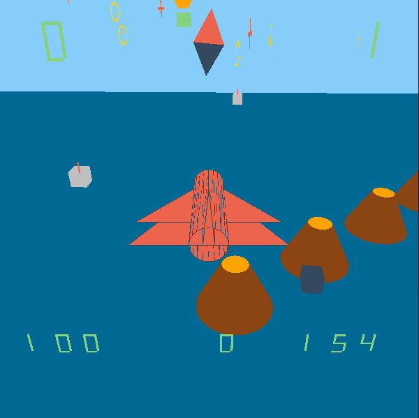

# Flight Simulator 
---

This is a basic 3D fighter simulator made in C++ using OpenGL.

The game has a square map with various checkpoint, obstacles, enemies, and collectibles sprawled across. 
Player wins the game if he/she marks all the checkpoints by destroying them. But be warned, a limited fuel supply, and health can come in your way.

Enemies Implemented  :
1) Ground Based Cannons 
2) Sky based special enemy.

Game has four checkpoints.

Plane can fire :
1)Bombs(dropped)
2)Missiles(launch corresponding to where the plane is aiming)

Be warned a series of volcanos split the map in two, crossing them is perilous, though possible. 
If a player does not want to risk certain death, he/she should take the long way round.

Random rings are randomly generated, collecting which player gets points.
Fuel tanks also randomly generated. Collect them to stay in the air longer.

Arrows in the sky guide plane to the next checkpoint.

Ground based cannons can shoot if you get too close. Sky based cannons can shoot regardless of position.

Following views have been implemented : 
1) Follow cam
2) First Person
3) Top
4) Tower
5) Helicopter

Controls :
w - Forward
a - Yaw left
d - Yaw right
q - Roll left
e - Roll right
up arrow - pitch up
down arrow - pitch down
space - fire Missiles
b -drop bomb
l - loopdaloop
k - barrel Roll

1 - Follow cam
2 - First Person View 
3 - Top view 
4 - Tower View 
5 - Helicopter View 

